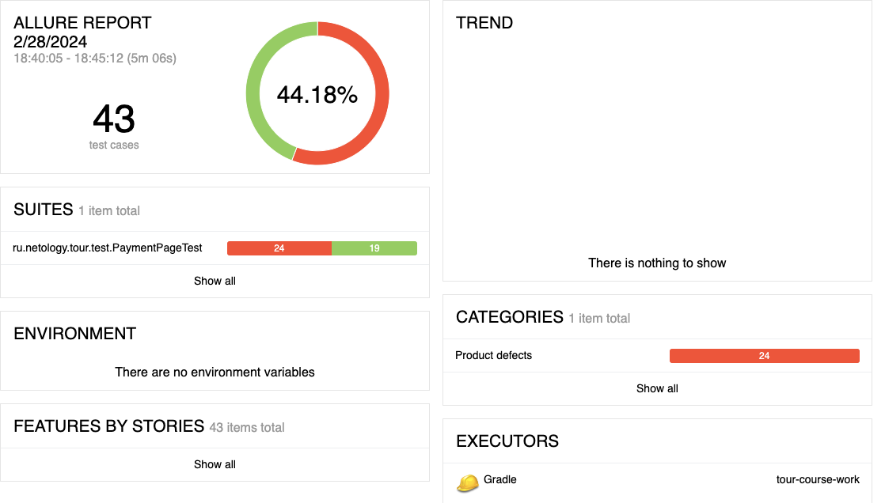
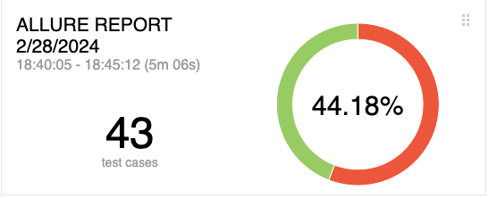
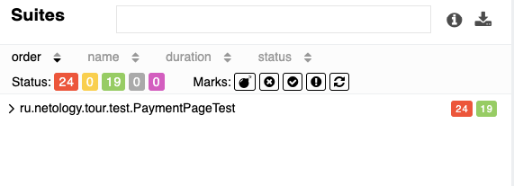
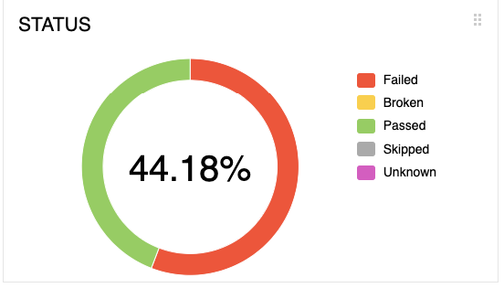
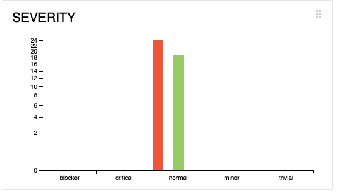

### Отчет по итогам тестирования
___
В соответствии с поставленной задачей было произведено тестирования веб-сервиса по покупке тура.

В ходе тестирования были реализованы позитивные и негативные сценарии. Всего выполнено 43 тест-кейса:

успешных - 19 (44,18%);

неуспешных - 24 (55,82%).

В результате тестирования составлено 38 issues.

___
### Общие рекомендации:

* добавить элементам страницы атрибут test-id;
* исправить выявленные дефекты;
* необходима качественная документация, описывающая требуемое поведение приложения.